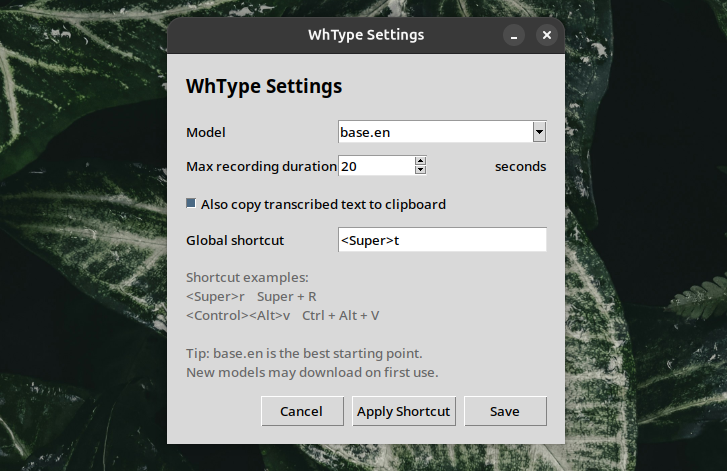

# Wh Voice Type

Local voice typing for GNOME/Linux using faster-whisper.

WhType records your voice, transcribes it locally, and types the text into the active window.

## Folder Structure

    WhType/
    ├── bin/
    │   ├── wh-type
    │   ├── wh-type-toggle
    │   └── wh-type-settings
    ├── install.sh
    ├── repair.sh
    ├── setup-shortcut.sh
    ├── setup-settings-launcher.sh
    ├── requirements.txt
    └── README.md

## Requirements

Tested on Ubuntu/GNOME.

The system needs:

- Python 3
- python3-venv
- python3-pip
- python3-tk
- PipeWire recording tools
- sox
- ydotool
- ydotoold service
- wl-clipboard
- Internet connection for first model download

## Debian / Ubuntu Package Installation

If you downloaded the `.deb` package from GitHub Releases, install it with:

    sudo apt install ./whtype_0.1.1_all.deb

After installation, open the app menu and search:

    Wh Voice Type Settings

On first opening, setup will run automatically.

This will:

- create the user WhType folder
- create the Python virtual environment
- install faster-whisper
- download/load the base.en model
- create the Super+R keyboard shortcut
- open the settings window

After setup, press:

    Super + R

You can open settings by searching:

    Wh Voice Type Settings

Or from Terminal:

    whtype-settings

## Install

Extract the WhType folder.

Then run:

    cd WhType
    ./install.sh

Do not run the installer with sudo.

The installer will use sudo only when required for system packages and ydotoold.

The installer will:

- install required system packages
- create the Python virtual environment
- install faster-whisper
- start ydotoold
- download/load the base.en model
- create the Super+R keyboard shortcut
- create the Wh Voice Type Settings app launcher

## Usage

Press:

    Super + R

Press once to start recording.

Press again to stop recording and type the transcribed text.

## Settings

After installation, open the app menu and search:

    Wh Voice Type Settings

You can also open settings from Terminal:

    ./bin/wh-type-settings

Settings available:

- Choose model
- Set max recording duration
- Choose whether transcribed text is also copied to clipboard

## Default Model

The default model is:

    base.en

Model options include:

- tiny.en
- base.en
- small.en
- medium.en

New models may download on first use.

## Default Recording Duration

The default max recording duration is:

    20 seconds

You can change this from Wh Voice Type Settings.

## Logs

Check logs with:

    tail -n 100 /tmp/wh-type.log

## Repair

If WhType stops working after a system update, run:

    cd WhType
    ./repair.sh

## Manual Shortcut Command

If the shortcut is not created automatically, create a GNOME custom shortcut manually.

Shortcut:

    Super + R

Command:

    /path/to/WhType/bin/wh-type-toggle

Example:

    /home/username/Softwares/WhType/bin/wh-type-toggle

## Manual Settings Launcher

If the settings app does not appear in the app menu, run:

    ./setup-settings-launcher.sh

Then search for:

    Wh Voice Type Settings

## Notes

The Python virtual environment is not fully portable across systems.

When sharing WhType with others, do not include the .venv folder.

The model cache can be included, but it will make the zip file larger.

## Recommended Zip Command

From the folder that contains WhType:

    zip -r WhType.zip WhType -x "WhType/.venv/*" -x "WhType/models/*" -x "WhType/__pycache__/*"

## Changing the Global Shortcut

Open Wh Voice Type Settings from the app menu.

Shortcut examples:

    <Super>r
    <Control><Alt>v
    <Control><Super>r

After changing the shortcut, click Save.

